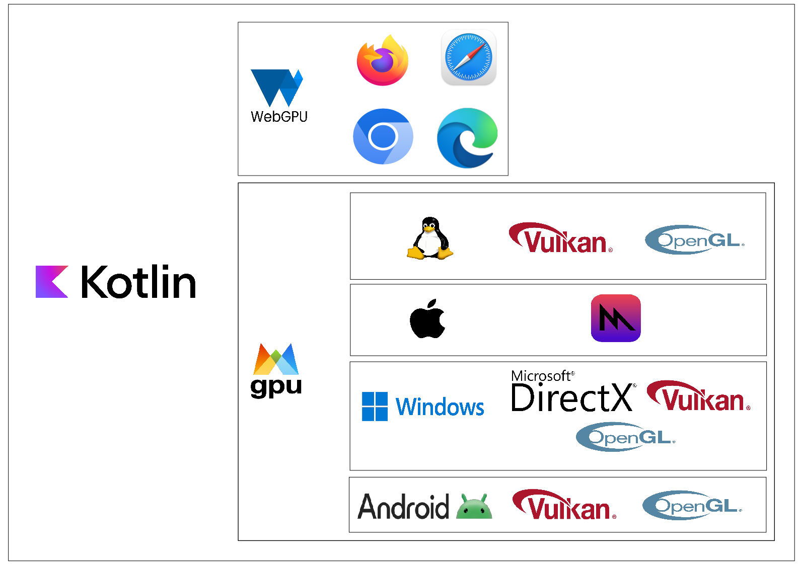

# wgpu4k Architecture Overview & Supported Platforms

wgpu4k is a Kotlin Multiplatform library that provides a unified interface to WebGPU and native graphics APIs across multiple platforms.

## Framework Components

This project provide different flavor regarding your need

- [wgpu4k](https://github.com/wgpu4k/wgpu4k) Provide high order binding to cover all platforms including browser
- [wgpu4k toolkit](https://github.com/wgpu4k/wgpu4k) Provide the glue to create windows and a context easily, do not use this project of you want to manage that youself.
- [wgpu4k native](https://github.com/wgpu4k/wgpu4k-native) Provide native low level binding to cover only Linux/MacOS/Windows/Android/iOS platforms
- [webgpu ktypes](https://github.com/wgpu4k/webgpu-ktypes) Generated interfaces from the WebGPU specifications, this is the base of wgpu4k implementation, but can be reused to create a custom binding, for example with a backend like Dawn
- [webgpu ktypes WEB](https://github.com/wgpu4k/webgpu-ktypes) Generated web binding from the WebGPU specifications supporting kotlin/JS and kotlin/WasmJS with a common API.

## Architecture Components

The architecture consists of three main layers:

1. **Binding Layer (Kotlin)**
2. **GPU Abstraction Layer**
3. **Platform-Specific Backends**

## Detailed Architecture Breakdown

### 1. Web Platform Support

The web implementation uses WebGPU as its foundation, providing compatibility with modern browsers:

- Firefox
- Chrome/Chromium
- Edge
- Safari

The WebGPU standard ensures consistent behavior across all supported browsers while leveraging each browser's optimized implementation.

### 2. Native Platform Support

wgpu4k provides native implementations for various operating systems:

#### Linux (JVM)
- Vulkan (primary)
- OpenGL (fallback)

#### macOS (JVM + Native)
- Metal (primary)

#### iOS
- Metal (primary)

#### Windows (JVM)
- DirectX 12 (primary)
- Vulkan (alternative)
- OpenGL (fallback)

#### Android
- Vulkan (primary)
- OpenGL ES (fallback)

### 3. Kotlin Multiplatform Integration

The Kotlin layer provides:

- A unified API surface across all platforms
- Type-safe GPU programming
- Coroutine support for asynchronous operations
- Memory management abstractions
- Error handling mechanisms

## External links

* [WGPU Supported Platforms](https://github.com/gfx-rs/wgpu?tab=readme-ov-file#supported-platforms) - Detailed information about all supported operating systems
